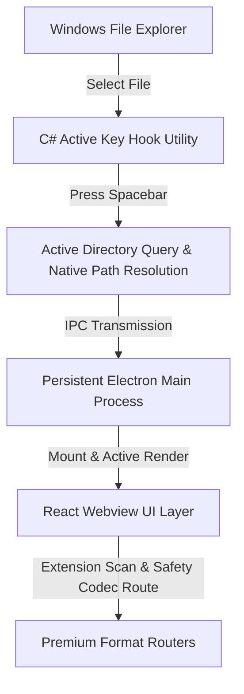

# 🌟 Peek — Quick Look for Windows

**Peek** is a lightweight, blazing-fast, and premium desktop utility that brings the magic of macOS-style instant file previews to Windows. 

Simply select any file or folder in your Windows File Explorer, tap the **`[ Spacebar ]`**, and preview the content instantly in a gorgeous, modern window without ever opening a heavy application. Tap **`[ Spacebar ]`** or **`[ Escape ]`** again to dismiss.

---

## ✨ Premium Features

- ⚡ **Instant Previews**: Tapping `Spacebar` brings up previews in milliseconds.
- 🎨 **macOS Quick Look Aesthetic**: Beautiful transparent frame, refined glassmorphic drop shadows, smooth scale-in animations, and a sleek dark-mode toolbar.
- 📂 **Rich Format Support**:
  - **Images**: PNG, JPG, JPEG, GIF, WebP, SVG, BMP, ICO.
  - **Documents**: High-fidelity PDF rendering with native browser plugins.
  - **Office Files**: Advanced previewing for DOCX, XLSX, and PPTX spreadsheets/presentations.
  - **Audio**: Dedicated waveforms and elegant playback panels.
  - **Video**: Lightweight native HTML5 playback for MP4, WebM, and OGG formats.
  - **Code**: Premium GitHub-inspired syntax highlighting with line numbering for JavaScript, TypeScript, Python, HTML, CSS, SQL, Shell Scripts, Markdown, JSON, YAML, and logs.
  - **Folders**: Native statistics trees showing folder sizes, sub-directories, and file count metadata.
- 🛡️ **Stable Sandbox & Crash Recovery**: Integrated React Error Boundaries prevent rendering crash lockups. If a rendering engine thread fails, the app automatically isolates it and recovers transparently.
- ⚙️ **Invisible System Tray Integration**: Minimizes silently to the Windows System Tray, supports running at startup, and features an adaptive recovery loop.

---

## ⚙️ How It Works Under the Hood

1. **Global Low-Level Hook (`PeekHook.exe`)**: A lightweight C# background worker listens for system-wide Spacebar key downs when Windows Explorer is active.
2. **Active Path Resolution**: The helper queries the active explorer instance's COM interface to resolve the selected file path without locks or registry hacks.
3. **IPC Transmission**: Paths are piped into a persistent Electron main process which coordinates active window bounds centered on the cursor's display monitor.
4. **React View Router**: React intercepts the file URL, screening for compatible codecs and rendering components safely inside isolated rendering trees.

---

## 📥 Installation Guide

Installing **Peek** is incredibly simple. We package the entire runtime into a single, self-installing Windows Setup executable.

### Step 1: Download the Installer
Go to the [Peek GitHub Releases](https://github.com/) page and download the latest release:
- **File**: `Peek.Setup.1.0.0.exe`

### Step 2: Install the App
1. Locate the downloaded `.exe` file in your downloads folder.
2. Double-click **`Peek Setup 1.0.0.exe`** to start the setup.
3. The installer runs silently and configures all background services instantly.
4. Peek will mount directly in your **Windows System Tray** (near the clock).

### Step 3: Start Previewing!
1. Open **Windows File Explorer** (`Win + E`).
2. Select any file (like an image, text file, code script, or PDF).
3. Press **`[ Spacebar ]`** to preview.
4. Press **`[ Spacebar ]`** or **`[ Escape ]`** to close it.

---

## ⌨️ Shortcut Keys Reference

| Hotkey | Action | Scope |
| :--- | :--- | :--- |
| **`Spacebar`** | Show preview of selected file / Hide active preview | Windows Explorer / Peek |
| **`Escape`** | Close active preview | Peek Focused |
| **`Left / Right / Up / Down`** | Move Explorer selection (Preview updates live!) | Windows Explorer |

---

## 📄 License
Peek is distributed under the **MIT License**. Created with passion to elevate the Windows desktop experience.
